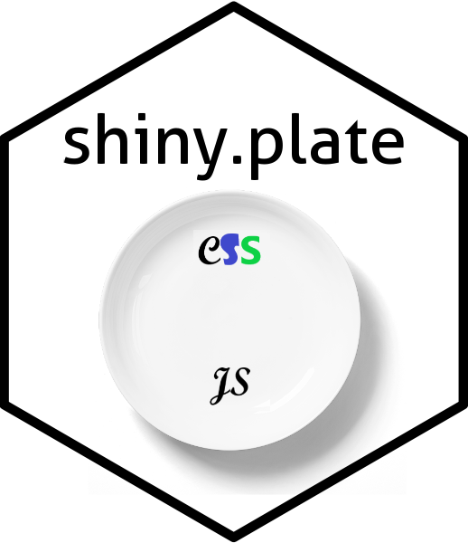

## {width=100}

## Shiny.plate

I'm a bit tired of always creating the sample few .R scripts and rewriting the same boilerplate code whenever I make a new shiny project. To assuage these woes I have created this package.

This package gives a single function, 'new_shiny_plate()', which is intended to set up a new R Shiny project with a CSS file and a javascript file hooked up to the Shiny app.

To install the package, please use `devtools::install_github('chrispmad/shiny.plate')`.

Once it is install, run the function like this: `r new_shiny_plate(filepath = 'path/to/directory')`, replacing the path to your choice directory.

Please report any issues or errors here on github.
